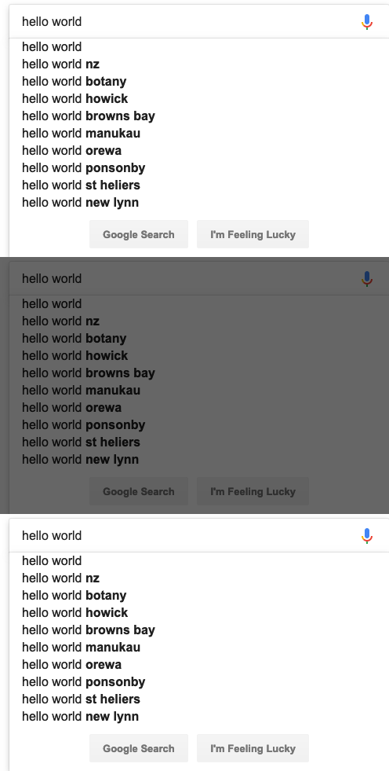

# chameleon
Visual Regression Testing for Front End Applications

## Install

`npm install @mgrk/chameleon --save-dev`

## Usage

Chameleon works by passing in a test and a master url of pages you wish to compare visually.
For specific parts of a page (such as a component) you may pass in a `selector` to the `options`.

For more granular control over the page, the `pageControl` function will let you control the page before a screenshot is taken.

Example use within a test:

```
import compare from '@mgrk/chameleon';

...

it('should match vr', async () => {
  const options = {
      testUrl: 'http://google.com',
      masterUrl: 'http://google.com',
      viewport: {
          width: 1024,
          height: 768
      },
      selector: '.A8SBwf', // CSS Selector
      controlPage: async page => {
          // page is a puppeteer page object (https://pptr.dev/#?product=Puppeteer&version=v1.12.2&show=api-class-page)
          await page.type('.gLFyf', 'hello world');
          await page.waitFor(300);
      }
  };

  expect(await compare(options)).toBe(true);
});
```

An output of the diff image will appear at `./diff.png`:
